# DotMac Platform - Deployment Topology Diagrams

**Last Updated:** November 9, 2025
**Status:** Production
**Version:** 1.0

---

## Table of Contents

1. [High-Level Deployment Topology](#high-level-deployment-topology)
2. [Control Plane Architecture](#control-plane-architecture)
3. [Tenant Namespace Layout](#tenant-namespace-layout)
4. [Shared Packages Relationship](#shared-packages-relationship)
5. [Data Flow Diagrams](#data-flow-diagrams)
6. [Network Boundaries](#network-boundaries)
7. [Multi-Region Deployment](#multi-region-deployment)
8. [Build and Deployment Pipeline](#build-and-deployment-pipeline)

---

## High-Level Deployment Topology

### Kubernetes Cluster Architecture

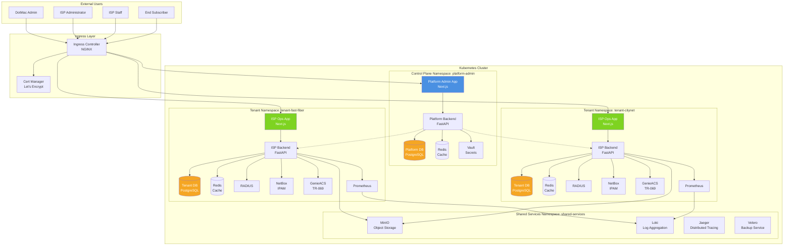

### Component Distribution

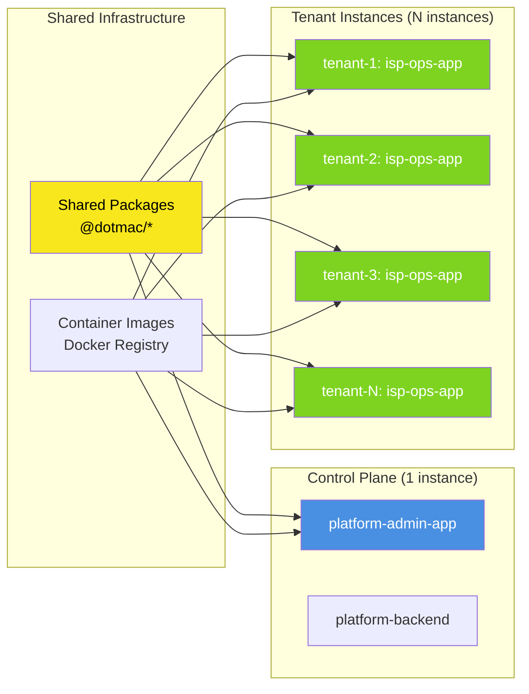

---

## Control Plane Architecture

### Platform Admin Components

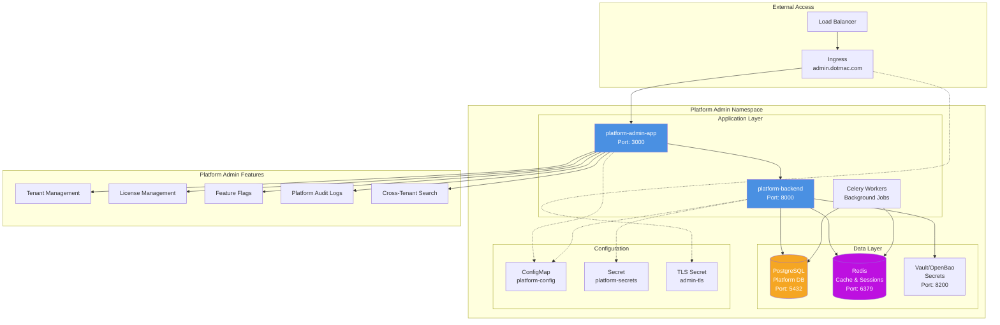

### Platform Admin Data Model

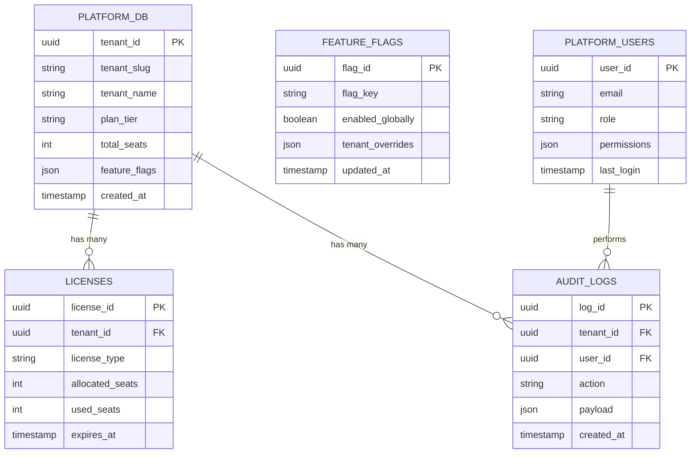

---

## Tenant Namespace Layout

### Per-Tenant Infrastructure

```mermaid
graph TB
    subgraph "Tenant Namespace: tenant-{slug}"
        subgraph "Application Layer"
            ISP[isp-ops-app<br/>Next.js<br/>Port: 3000]
            ISPB[isp-backend<br/>FastAPI<br/>Port: 8000]
            Worker[Celery Workers<br/>Background Jobs]
        end

        subgraph "Data Layer"
            TDB[(Tenant DB<br/>PostgreSQL<br/>Port: 5432)]
            TCache[(Redis<br/>Cache & Sessions<br/>Port: 6379)]
        end

        subgraph "Network Services"
            RADIUS[FreeRADIUS<br/>Auth: 1812<br/>Acct: 1813]
            NetBox[NetBox<br/>IPAM/DCIM<br/>Port: 8080]
            GenieACS[GenieACS<br/>TR-069/CPE<br/>Port: 7547]
            WG[WireGuard<br/>VPN<br/>Port: 51820]
        end

        subgraph "Monitoring Stack"
            Prom[Prometheus<br/>Metrics<br/>Port: 9090]
            Graf[Grafana<br/>Dashboards<br/>Port: 3001]
            FB[Fluent Bit<br/>Logs]
        end

        subgraph "Configuration"
            TCM[ConfigMap<br/>tenant-config]
            TSec[Secret<br/>tenant-secrets]
            TTLS[TLS Secret<br/>tenant-tls]
        end

        ISP --> ISPB
        ISPB --> TDB
        ISPB --> TCache
        ISPB --> RADIUS
        ISPB --> NetBox
        ISPB --> GenieACS
        Worker --> TDB
        Worker --> TCache

        ISPB --> Prom
        FB --> TDB
        Prom --> Graf

        ISP -.-> TCM
        ISPB -.-> TCM
        ISPB -.-> TSec
    end

    subgraph "External Access"
        TenantIngress[Ingress<br/>{tenant}.isp.dotmac.com]
        TLB[Load Balancer]
    end

    TLB --> TenantIngress
    TenantIngress --> ISP
    TenantIngress -.-> TTLS

    subgraph "ISP Operations Features"
        Subscribers[Subscriber Management]
        Billing[Customer Billing]
        NetworkOps[Network Operations]
        Support[Support Tickets]
        CustomerPortal[Customer Self-Service]
    end

    ISP --> Subscribers
    ISP --> Billing
    ISP --> NetworkOps
    ISP --> Support
    ISP --> CustomerPortal

    style ISP fill:#7ED321,color:#fff
    style ISPB fill:#7ED321,color:#fff
    style TDB fill:#F5A623,color:#fff
    style TCache fill:#BD10E0,color:#fff
    style RADIUS fill:#50E3C2,color:#000
```

### Tenant Data Model

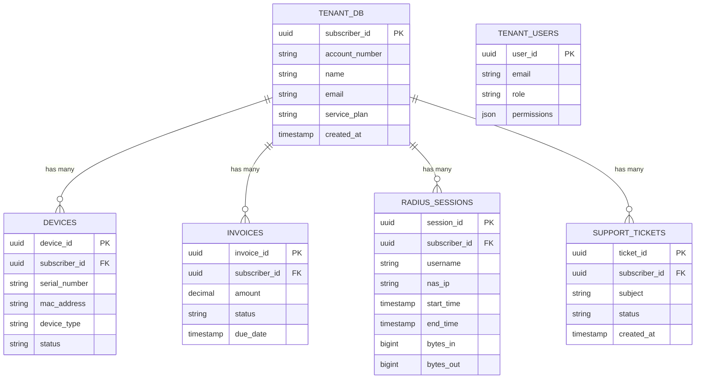

---

## Shared Packages Relationship

### Package Dependencies

```mermaid
graph TB
    subgraph "Applications"
        PA[platform-admin-app]
        ISP[isp-ops-app]
    end

    subgraph "Shared Packages Layer"
        subgraph "@dotmac/features"
            Analytics[analytics]
            ApiKeys[api-keys]
            Billing[billing]
            Campaigns[campaigns]
            CPE[cpe]
            CRM[crm]
            Customers[customers]
            Diagnostics[diagnostics]
            Faults[faults]
            Forms[forms]
            IPAM[ipam]
            Monitoring[monitoring]
            Network[network]
            Notifications[notifications]
            Provisioning[provisioning]
            RADIUS[radius]
            RBAC[rbac]
            Subscribers[subscribers]
        end

        subgraph "Core Packages"
            Primitives[@dotmac/primitives<br/>UI Components]
            UI[@dotmac/ui<br/>Composite UI]
            Headless[@dotmac/headless<br/>Hooks & Logic]
            GraphQL[@dotmac/graphql<br/>API Client]
            Auth[@dotmac/auth<br/>Authentication]
            DesignSystem[@dotmac/design-system<br/>Theming]
        end
    end

    PA --> Analytics
    PA --> ApiKeys
    PA --> RBAC
    PA --> Forms

    ISP --> Billing
    ISP --> Customers
    ISP --> Subscribers
    ISP --> Network
    ISP --> RADIUS
    ISP --> Provisioning
    ISP --> Faults
    ISP --> Monitoring
    ISP --> CRM
    ISP --> Campaigns

    Analytics --> UI
    Billing --> UI
    Customers --> UI
    Subscribers --> UI
    Network --> UI

    UI --> Primitives
    UI --> Headless

    PA --> Primitives
    PA --> UI
    PA --> Headless
    PA --> GraphQL
    PA --> Auth
    PA --> DesignSystem

    ISP --> Primitives
    ISP --> UI
    ISP --> Headless
    ISP --> GraphQL
    ISP --> Auth
    ISP --> DesignSystem

    GraphQL --> Headless
    Auth --> Headless

    style PA fill:#4A90E2,color:#fff
    style ISP fill:#7ED321,color:#fff
    style Primitives fill:#F8E71C,color:#000
    style UI fill:#F8E71C,color:#000
    style Headless fill:#F8E71C,color:#000
```

### Build Dependency Graph

```mermaid
graph TD
    subgraph "Build Order (Bottom-Up)"
        Level1[Level 1: Foundation]
        Level2[Level 2: Core]
        Level3[Level 3: Features]
        Level4[Level 4: Applications]
    end

    subgraph L1["Foundation Layer"]
        Primitives[@dotmac/primitives]
        DesignSystem[@dotmac/design-system]
    end

    subgraph L2["Core Layer"]
        Headless[@dotmac/headless]
        GraphQL[@dotmac/graphql]
        Auth[@dotmac/auth]
    end

    subgraph L3["Features Layer"]
        UI[@dotmac/ui]
        Features[@dotmac/features]
    end

    subgraph L4["Application Layer"]
        PlatformAdmin[platform-admin-app]
        ISPOps[isp-ops-app]
    end

    Level1 --> L1
    Level2 --> L2
    Level3 --> L3
    Level4 --> L4

    L1 --> L2
    L2 --> L3
    L3 --> L4

    Primitives --> Headless
    Primitives --> UI
    DesignSystem --> Primitives

    Headless --> GraphQL
    Headless --> Auth
    Headless --> Features

    GraphQL --> Features
    Auth --> Features
    UI --> Features

    Features --> PlatformAdmin
    Features --> ISPOps
    UI --> PlatformAdmin
    UI --> ISPOps
    Headless --> PlatformAdmin
    Headless --> ISPOps

    style Primitives fill:#F8E71C,color:#000
    style UI fill:#F8E71C,color:#000
    style Features fill:#F8E71C,color:#000
    style PlatformAdmin fill:#4A90E2,color:#fff
    style ISPOps fill:#7ED321,color:#fff
```

---

## Data Flow Diagrams

### User Authentication Flow

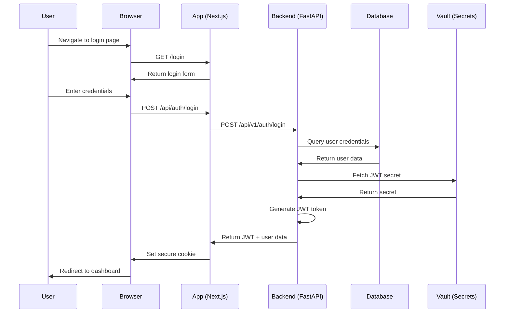

### Tenant Provisioning Flow

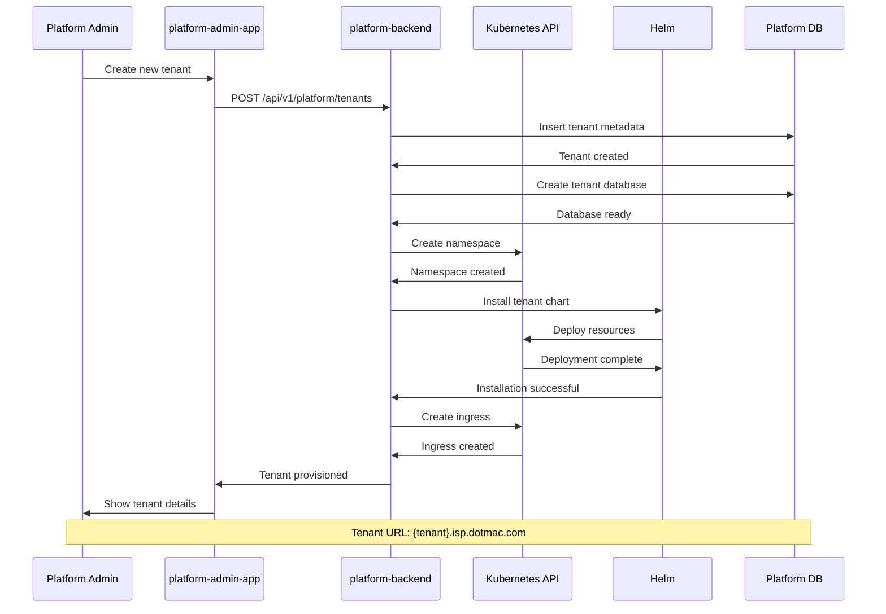

### API Request Flow (Tenant-Scoped)

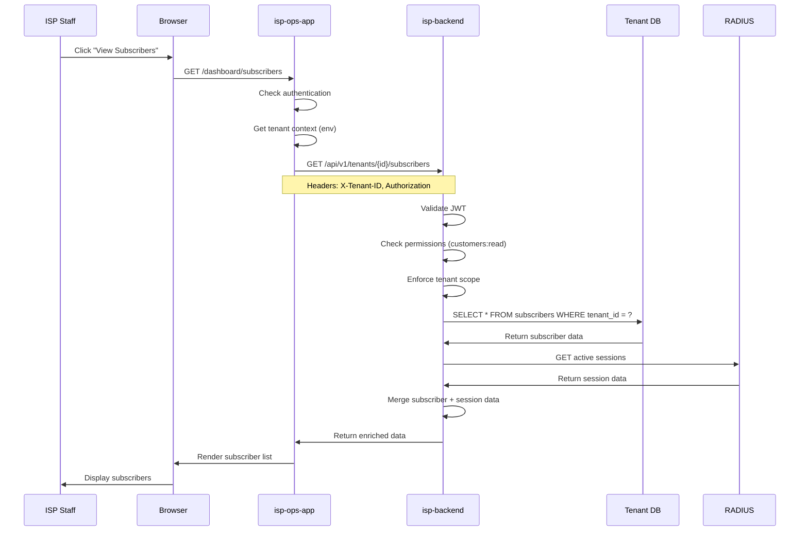

### Cross-Tenant Search Flow (Platform Admin)

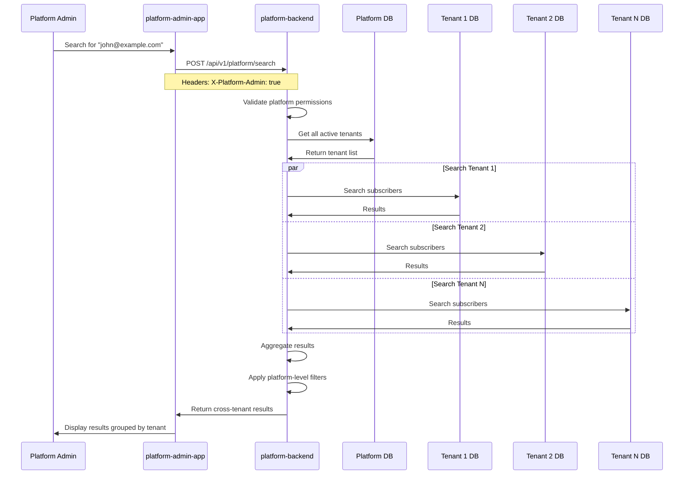

---

## Network Boundaries

### Network Policy Architecture

```mermaid
graph TB
    subgraph "External Traffic"
        Internet[Internet]
        LB[Load Balancer<br/>Public IP]
    end

    subgraph "Ingress Layer"
        Ingress[Ingress Controller<br/>NGINX]
        WAF[Web Application Firewall]
    end

    subgraph "Platform Admin Namespace"
        direction TB
        PA[platform-admin-app]
        PAB[platform-backend]
        PDB[(Platform DB)]
    end

    subgraph "Tenant Namespace 1"
        direction TB
        T1A[isp-ops-app]
        T1B[isp-backend]
        T1DB[(Tenant DB)]
    end

    subgraph "Tenant Namespace 2"
        direction TB
        T2A[isp-ops-app]
        T2B[isp-backend]
        T2DB[(Tenant DB)]
    end

    subgraph "Shared Services"
        Minio[MinIO]
        Loki[Loki]
    end

    Internet --> LB
    LB --> WAF
    WAF --> Ingress

    Ingress --> PA
    Ingress --> T1A
    Ingress --> T2A

    PA --> PAB
    PAB --> PDB
    PAB -.->|Can access| T1B
    PAB -.->|Can access| T2B

    T1A --> T1B
    T1B --> T1DB
    T1B --> Minio
    T1B --> Loki

    T2A --> T2B
    T2B --> T2DB
    T2B --> Minio
    T2B --> Loki

    T1B -.x|Blocked| T2B
    T1B -.x|Blocked| T2DB
    T2B -.x|Blocked| T1B
    T2B -.x|Blocked| T1DB

    style PA fill:#4A90E2,color:#fff
    style T1A fill:#7ED321,color:#fff
    style T2A fill:#7ED321,color:#fff
    style PDB fill:#F5A623,color:#fff
    style T1DB fill:#F5A623,color:#fff
    style T2DB fill:#F5A623,color:#fff
```

### Network Policy Rules

```mermaid
graph LR
    subgraph "Platform Admin Egress"
        PA[Platform Admin Pods]
        PA -->|Allow| PADB[Platform DB]
        PA -->|Allow| PARedis[Redis]
        PA -->|Allow| AllTenants[All Tenant Namespaces]
        PA -->|Allow| Internet[External Internet]
    end

    subgraph "Tenant Ingress"
        TI[Tenant Pods]
        PlatformNS[Platform Admin NS] -->|Allow| TI
        SameNS[Same Namespace] -->|Allow| TI
        OtherTenants[Other Tenant NS] -.x|Deny| TI
        ExternalInternet[External Internet] -->|Allow via Ingress| TI
    end

    subgraph "Tenant Egress"
        TE[Tenant Pods]
        TE -->|Allow| TenantDB[Tenant DB]
        TE -->|Allow| TenantRedis[Tenant Redis]
        TE -->|Allow| PlatformAPIs[Platform APIs]
        TE -->|Allow| SharedSvc[Shared Services]
        TE -->|Allow| ExternalAPI[External APIs<br/>HTTPS only]
        TE -.x|Deny| OtherTenantDBs[Other Tenant DBs]
    end

    style PA fill:#4A90E2,color:#fff
    style TI fill:#7ED321,color:#fff
    style TE fill:#7ED321,color:#fff
```

### Security Zones

```mermaid
graph TB
    subgraph "DMZ (Public Zone)"
        LB[Load Balancer]
        Ingress[Ingress Controller]
        WAF[WAF]
    end

    subgraph "Application Zone"
        PA[Platform Admin App]
        T1[Tenant 1 App]
        T2[Tenant 2 App]
    end

    subgraph "Data Zone (Restricted)"
        PDB[(Platform DB)]
        T1DB[(Tenant 1 DB)]
        T2DB[(Tenant 2 DB)]
    end

    subgraph "Secrets Zone (Highly Restricted)"
        Vault[Vault/OpenBao]
        Secrets[K8s Secrets]
    end

    Internet[Internet] --> DMZ
    DMZ --> Application Zone
    Application Zone --> Data Zone
    Application Zone -.->|TLS Only| Secrets Zone

    style DMZ fill:#FF6B6B,color:#fff
    style "Application Zone" fill:#4ECDC4,color:#fff
    style "Data Zone" fill:#F7B731,color:#fff
    style "Secrets Zone" fill:#5F27CD,color:#fff
```

---

## Multi-Region Deployment

### Geographic Distribution

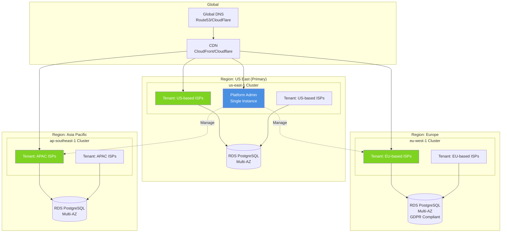

### Data Residency Compliance

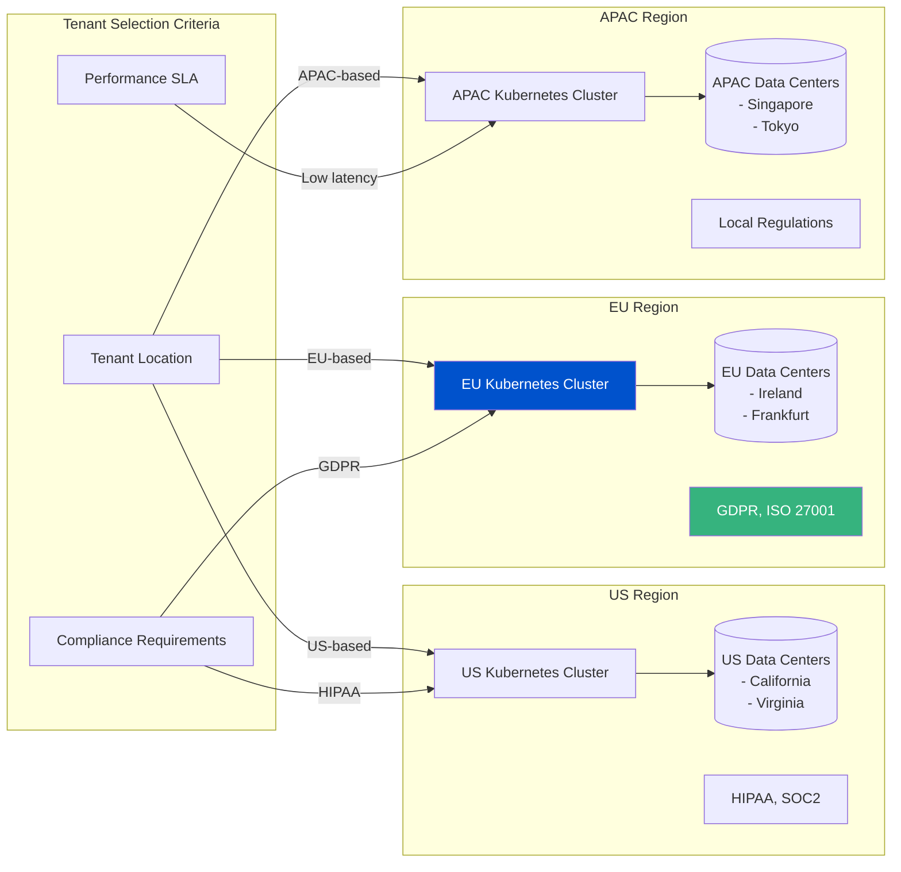

---

## Build and Deployment Pipeline

### CI/CD Pipeline Flow

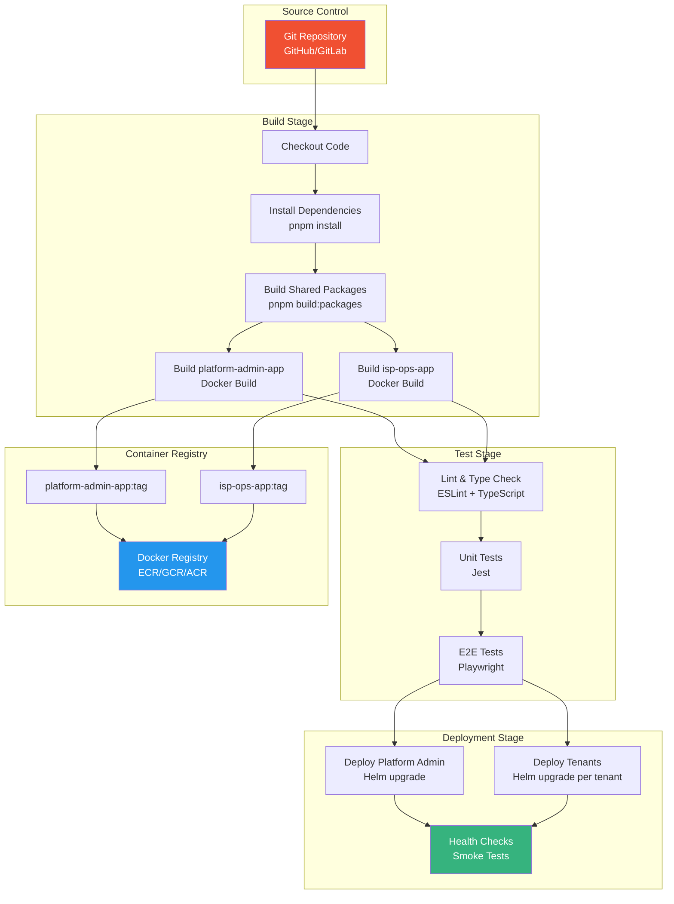

### Docker Build Process

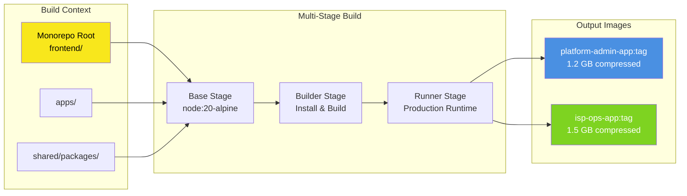

### Deployment Strategies

```mermaid
graph TB
    subgraph "Platform Admin Deployment (Blue-Green)"
        CurrentPA[Current Version<br/>v1.2.3]
        NewPA[New Version<br/>v1.3.0]
        Router[Router/Load Balancer]

        Router -->|100% traffic| CurrentPA
        Router -.->|0% traffic| NewPA

        NewPA -.->|Health check passes| Switch[Switch Traffic]
        Switch -->|100% traffic| NewPA
        Switch -.->|Rollback if needed| CurrentPA
    end

    subgraph "Tenant Deployment (Rolling Update)"
        Tenant1[Tenant 1<br/>v1.2.3]
        Tenant2[Tenant 2<br/>v1.2.3]
        Tenant3[Tenant 3<br/>v1.2.3]
        TenantN[Tenant N<br/>v1.2.3]

        Tenant1 --> Updated1[Tenant 1<br/>v1.3.0]
        Updated1 -.->|Wait & Verify| Tenant2
        Tenant2 --> Updated2[Tenant 2<br/>v1.3.0]
        Updated2 -.->|Wait & Verify| Tenant3
        Tenant3 --> Updated3[Tenant 3<br/>v1.3.0]
        Updated3 -.->|Continue...| TenantN
    end

    subgraph "Canary Deployment (Optional)"
        Production[Production Traffic<br/>100%]
        Stable[Stable Version<br/>v1.2.3]
        Canary[Canary Version<br/>v1.3.0]

        Production -->|95% traffic| Stable
        Production -->|5% traffic| Canary

        Canary -.->|Monitor metrics| Promote[Promote to 100%]
        Promote --> StableV2[All Traffic<br/>v1.3.0]
    end

    style CurrentPA fill:#7ED321,color:#fff
    style NewPA fill:#4A90E2,color:#fff
    style Updated1 fill:#4A90E2,color:#fff
    style Canary fill:#F5A623,color:#fff
```

---

## Summary

### Deployment Topology Key Points

1. **Control Plane**: Single `platform-admin-app` instance in dedicated namespace
2. **Tenant Instances**: One `isp-ops-app` deployment per tenant in isolated namespaces
3. **Shared Packages**: Built once, bundled into both app images
4. **Network Isolation**: Kubernetes network policies enforce tenant separation
5. **Data Isolation**: Each tenant has dedicated database (no cross-tenant data access)
6. **Geographic Distribution**: Tenants deployed in regions based on compliance and performance
7. **CI/CD Pipeline**: Monorepo build → Docker images → Helm deployments
8. **Scaling Strategy**: Platform admin (vertical), Tenants (horizontal)

### Resource Distribution

| Component | Control Plane | Per-Tenant | Shared |
|-----------|---------------|------------|--------|
| Frontend App | 1 instance | N instances | - |
| Backend API | 1 instance | N instances | - |
| PostgreSQL | 1 database | 1 database | - |
| Redis | 1 instance | 1 instance | - |
| RADIUS | - | 1 instance | - |
| NetBox | - | 1 instance | - |
| Monitoring | Platform-wide | Per-tenant | Centralized logs |
| Object Storage | - | - | Shared (bucket isolation) |

### Network Topology

- **External Access**: Load Balancer → Ingress → Apps
- **Platform to Tenants**: Allowed (management)
- **Tenant to Tenant**: Blocked (isolation)
- **Tenant to Platform**: Allowed (API calls)
- **Tenant to Internet**: Allowed (RADIUS, APIs)

### Deployment Patterns

1. **Platform Admin**: Blue-green deployment (zero downtime)
2. **Tenants**: Rolling update (staged rollout)
3. **Canary**: Optional for high-risk changes
4. **Rollback**: Automated via Helm history

---

## Related Documentation

- [DEPLOYMENT_MODEL.md](/Users/michaelayoade/Downloads/Projects/dotmac-ftth-ops/docs/architecture/DEPLOYMENT_MODEL.md) - Detailed deployment architecture
- [DEPLOYMENT_PROCESS.md](/Users/michaelayoade/Downloads/Projects/dotmac-ftth-ops/docs/deployment/DEPLOYMENT_PROCESS.md) - Step-by-step deployment guide
- [PRODUCTION_DEPLOYMENT_K8S.md](/Users/michaelayoade/Downloads/Projects/dotmac-ftth-ops/frontend/PRODUCTION_DEPLOYMENT_K8S.md) - Kubernetes manifests and Helm charts

---

**Maintained by**: DotMac Platform Engineering
**Last Review**: November 9, 2025
**Next Review**: Quarterly or when infrastructure changes occur
